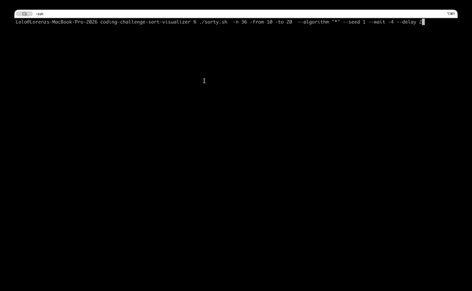
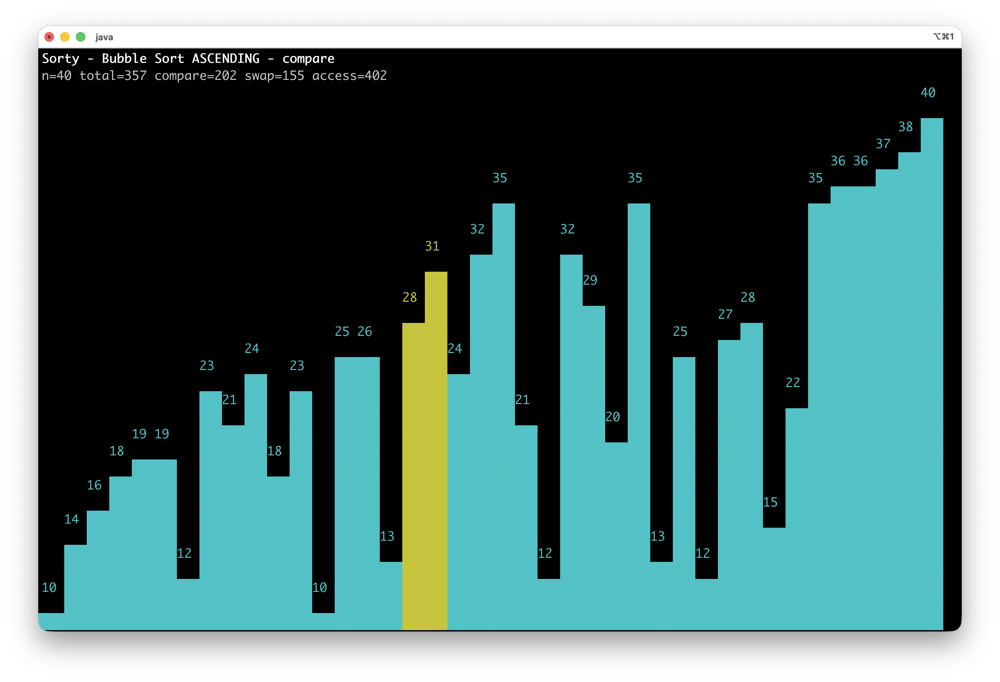
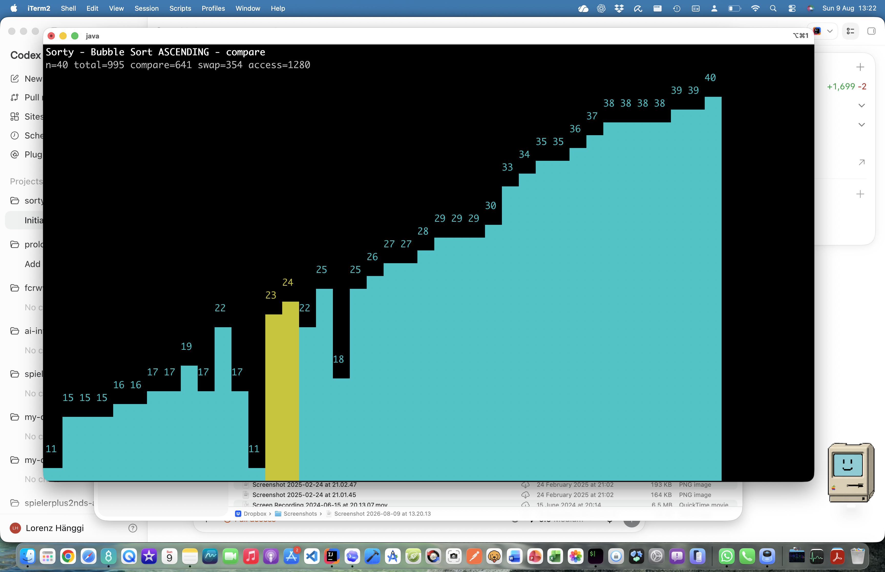
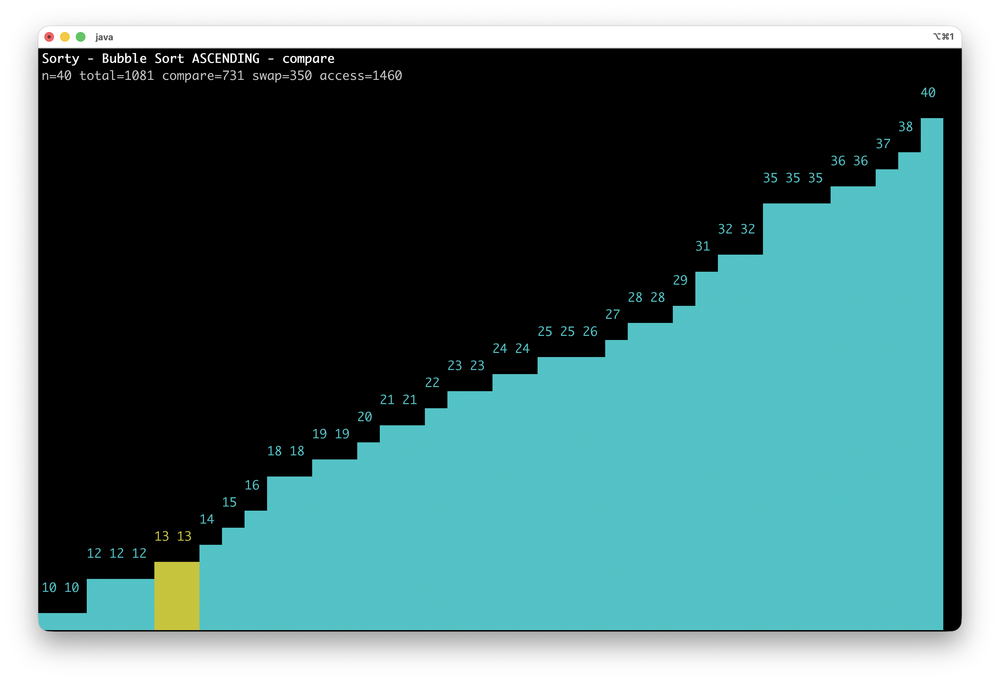

# Sorty

Sorty is a Java 26 command-line sorting visualizer. It generates random integers, sorts them with the current sorting algorithm, and can display progress in a fullscreen Lanterna text UI or as console logs.


The project is a Gradle multi-project build with one module:

- `sorty`

## Snapshots

Bubble sort - yellow comparing


Bubble sort - orange swapping


Bubble sort - almost done



## Requirements

- Java 26
- macOS `/usr/libexec/java_home` support for `sorty.sh`
- Gradle wrapper from this repository

The Gradle build is configured for Java 26 in `sorty/build.gradle`. The root `gradle.properties` pins the Gradle daemon to the local Java 26 JDK path.

## Build

Run tests:

```bash
env -u JAVA_HOME ./gradlew test
```

Build the install distribution:

```bash
env -u JAVA_HOME ./gradlew installDist
```

Run the installed command through the helper script:

```bash
./sorty.sh
```

`sorty.sh` reads the Java version from Gradle files in the current directory and uses `/usr/libexec/java_home` to select a matching JDK before launching `sorty`.

## Usage

Lanterna fullscreen UI is the default:

```bash
./sorty.sh -n 40 --seed 1 -f
```

Console logging can be selected explicitly:

```bash
./sorty.sh -c -vv -n 10 --seed 1 -f
```

Descending sort:

```bash
./sorty.sh -d -n 40 --seed 1
```

Custom generated number range:

```bash
./sorty.sh -n 30 --seed 7 -from 10 -to 200
```

Stop the fullscreen UI with Ctrl-C.

Pause the Lanterna UI with Space. Press `n` while paused to advance one frame, or press `s` while running or paused to restart from the original values. Use `--wait` to keep the final screen open until any key is pressed.

## CLI Options

```text
Usage: sorty [-249cdhlvV] [-16] [-vv] [--wait] [--algorithm=ALGORITHM]
             [--delay=MS] [-from=MIN] [-n=TOTAL] [--seed=SEED] [-to=MAX]
```

Options:

- `-n`, `--number-count=TOTAL`: total generated numbers to sort. Default: `20`.
- `--seed=SEED`: random seed. Default: `0`.
- `-from`, `--from=MIN`: smallest generated number. Default: `10`.
- `-to`, `--to=MAX`: largest generated number. Default: `100`.
- `--algorithm=ALGORITHM`: sorting algorithm list. Use one name, comma-separated names like `BUBBLE,QUICK`, or `*` for all algorithms. Default: `BUBBLE`.
- `--delay=MS`: delay between visualization events in milliseconds. Default: `100`. Use `0` for no delay.
- `-2`: run selected algorithms in batches of 2 for split-screen comparison.
- `-4`: run selected algorithms in batches of 4 for split-screen comparison. With `--algorithm=*`, algorithms are processed in enum order, four at a time.
- `-9`: run selected algorithms in batches of 9 for 3x3 split-screen comparison on large screens.
- `-16`: run selected algorithms in batches of 16 for 4x4 split-screen comparison on large screens.
- `-d`, `--descending`: sort largest to smallest.
- `-l`, `--lanterna`: use fullscreen Lanterna text UI. This is the default.
- `--wait`: keep the final Lanterna screen open until any key is pressed. When multiple algorithms or batches run, only the last one waits.
- `-c`, `--console`: use console UI logging instead of Lanterna.
- `-v`: verbose output.
- `-vv`: extra verbose output.
- `-h`, `--help`: show help.
- `-V`, `--version`: show version.

Only one split option may be selected at a time: `-2`, `-4`, `-9`, or `-16`.

## Sort Algorithms

we have implemented the following sort alogithms.

- Bubble Sort - https://de.wikipedia.org/wiki/Bubblesort
- Insertion Sort - https://en.wikipedia.org/wiki/Insertion_sort
- Selection Sort - https://de.wikipedia.org/wiki/Selectionsort
- Merge Sort - https://de.wikipedia.org/wiki/Mergesort
- Quick Sort - https://de.wikipedia.org/wiki/Quicksort
- Heap Sort - https://de.wikipedia.org/wiki/Heapsort
- Shell Sort - https://en.wikipedia.org/wiki/Shellsort
- Radix Sort - https://en.wikipedia.org/wiki/Radix_sort
- Cocktail Sort - https://en.wikipedia.org/wiki/Cocktail_shaker_sort
- Comb Sort - https://en.wikipedia.org/wiki/Comb_sort
- Gnome Sort - https://en.wikipedia.org/wiki/Gnome_sort
- Tim Sort - https://en.wikipedia.org/wiki/Timsort
- Intro Sort - https://en.wikipedia.org/wiki/Introsort
- Bogo Sort - https://en.wikipedia.org/wiki/Bogosort

## UI Behavior

Lanterna renders bars in the terminal: was an Google Code and now on github https://github.com/mabe02/lanterna

- Each bar represents one generated value.
- The value is displayed centered above its bar.
- Compared indices are highlighted yellow.
- Swapped indices are highlighted orange.
- Accessed values are highlighted green.
- Written values are highlighted dark green.
- The header displays number count, total operations, comparisons, swaps, value accesses, and writes.
- Press Space to pause the animation, `n` to step one frame, or `s` to restart from the original values.
- By default, the final screen remains visible for `500ms` as part of the close procedure. With `--wait`, it remains visible until any key is pressed.

Console UI logs protocol events and summary counters when verbose flags are enabled.

## Development Notes

The core flow is:

- `Sorty`: Picocli command and option parsing.
- `Sorter`: random number generation and algorithm wiring.
- `EventHandler`: protocol counters and delay throttling.
- `SorterProtocol`: UI/event protocol.
- `BubbleSorter`: bubble sort implementation.
- `InsertSorter`: insertion sort implementation.
- `SelectionSorter`: selection sort implementation.
- `MergeSorter`: merge sort implementation.
- `QuickSorter`: quick sort implementation.
- `HeapSorter`: heap sort placeholder.
- `ShellSorter`: shell sort implementation.
- `RadixSorter`: radix sort implementation.
- `CocktailSorter`: cocktail shaker sort implementation.
- `CombSorter`: comb sort implementation.
- `GnomeSorter`: gnome sort implementation.
- `TimSorter`: Tim sort implementation.
- `IntroSorter`: intro sort implementation.
- `BogoSorter`: bounded bogo sort implementation.
- `LanternaUiDelegate`: fullscreen terminal visualization.
- `ConsoleUiDelegate`: console event logging.
- `NoOpUiDelegate`: quiet test/default delegate for non-CLI sorter use.

When CLI switches are changed, update this README in the same change.
